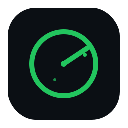

<p align="center">
  
</p>

<h1 align="center">SystemScope</h1>

<p align="center">개발자를 위한 Electron 기반 시스템 모니터링 데스크톱 앱입니다.<br/>CPU, 메모리, GPU, 디스크 사용량을 실시간으로 확인하고, 폴더 스캔과 빠른 정리 후보 탐색까지 한 앱에서 제공합니다.</p>

## 주요 기능

### 1. 실시간 시스템 모니터링

- CPU 사용률, 코어별 부하, 모델, 클럭 표시
- 메모리 전체/사용/가용량과 실제 메모리 압박도 표시
- GPU 사용 가능 여부, 메모리 사용량, 온도 표시
- 디스크 사용량 표시
- 1초 간격 실시간 시스템 업데이트
- 최근 히스토리를 기반으로 한 실시간 차트 표시

### 2. 알림 시스템

- 디스크, 메모리, GPU 메모리 사용률 기반 경고/치명 알림
- 경고와 치명 임계치 개별 설정 가능
- 설정값은 저장되며 앱 재시작 후에도 유지
- 알림 중복 폭주를 막기 위한 cooldown 적용

기본 임계치:

- Disk warning: `80%`
- Disk critical: `90%`
- Memory warning: `80%`
- Memory critical: `90%`
- GPU memory warning: `80%`
- GPU memory critical: `90%`

### 3. 디스크 분석

- 임의 폴더 선택 후 비동기 스캔
- 스캔 진행 상태와 취소 지원
- 폴더 트리맵 시각화
- 대용량 파일 상위 목록 제공
- 확장자별 용량 분포 분석
- 스캔 결과 요약
  - 총 용량
  - 파일 수
  - 폴더 수
  - 소요 시간

현재 폴더 스캔 특성:

- 최대 깊이: `5`
- 배치 동시성: `50`
- 심볼릭 링크는 재귀 탐색에서 제외
- 접근 불가 파일/폴더는 건너뜀

### 4. 빠른 정리 후보 탐색

자주 커지는 경로를 미리 정의해 빠르게 용량을 확인합니다.

macOS 예시:

- `~/Library/Caches`
- `~/Library/Logs`
- `~/Downloads`
- `~/.Trash`
- Homebrew cache / logs / cellar
- Xcode DerivedData / Archives / CoreSimulator
- npm / yarn / pnpm / pip / Cargo / Gradle / Maven 캐시
- Docker / OrbStack 데이터
- Chrome / Safari 캐시

Windows 예시:

- Temp
- Downloads
- Recycle Bin
- Windows Update cache
- Crash dumps
- Chrome / Edge cache
- npm / yarn / pnpm / pip / NuGet / Cargo / Gradle / Maven 캐시
- Docker 데이터
- VS Code extensions

각 항목은 다음 속성을 포함합니다.

- 경로
- 설명
- 추정 크기
- 카테고리
- 정리 가능 여부

### 5. Growth View (폴더 성장 추세)

홈 디렉토리 주요 폴더의 용량 변화를 스냅샷 기반으로 추적합니다.

- 스냅샷 방식: 주기적으로 폴더 크기를 JSON 파일에 기록하고, 과거 스냅샷과 현재를 비교하여 실제 증감량 계산
- 기간 선택: 1시간 / 24시간 / 7일
- "가장 빠르게 커지는 폴더 TOP 5" 수평 바 차트
- 전체 폴더 증가량 + 증가율(%) 목록
- 대시보드와 디스크 페이지 모두에서 동일 데이터 표시 (Zustand 캐싱)
- 앱 시작 시 자동 분석

스냅샷 설정:

- 저장 위치: `userData/snapshots/growth.json`
- 기본 주기: 60분 (Settings에서 15분/30분/1시간/2시간/6시간 변경 가능)
- 최대 보관: 168개
- 앱 시작 시 즉시 1회 + 이후 설정된 주기마다 자동 기록

### 6. 최근 급성장 폴더 (폴더 스캔 결과 내)

스캔한 폴더 내에서 최근 N일(1/3/7/14/30일) 동안 추가되거나 수정된 파일을 기준으로 급격히 커진 폴더를 찾습니다.

- 파일 `mtime` 기준으로 최근 변경 파일 크기 집계
- 폴더별 그룹핑
- 기간 선택 가능 (1일 ~ 30일)
- 클릭 시 Finder / Explorer에서 열기

### 7. 중복 파일 찾기

스캔한 폴더 내 중복 파일을 탐색합니다.

- 1단계: 파일 크기로 후보 그룹핑 (빠른 필터)
- 2단계: 같은 크기 파일의 head+tail 샘플 해시로 추가 축소
- 3단계: 최종 후보만 전체 해시로 확정
- 100KB 이상 파일 대상, 최대 50그룹
- 각 중복 그룹의 낭비 용량 합계 표시
- 접기/펼치기로 중복 파일 경로 확인, 각 파일에 Open 버튼

### 8. 사용자 공간 요약

홈 디렉터리 기준 주요 폴더의 용량을 한눈에 보여줍니다.

macOS 예시:

- Documents
- Downloads
- Desktop
- Pictures
- Movies
- Music
- Developer
- Library
- Trash

Windows 예시:

- Documents
- Downloads
- Desktop
- Pictures
- Videos
- Music
- AppData

### 9. 프로세스 모니터링

- CPU 사용률 상위 프로세스 목록
- 메모리 사용률 상위 프로세스 목록
- 2초 간격 갱신

### 10. 시스템 연동

- 폴더 선택 다이얼로그
- Finder / Explorer에서 경로 열기
- 창 크기, 위치, 최대화 상태 저장

### 11. UI 패턴

- 아코디언: 대시보드 위젯, Quick Scan, Large Files, Extensions, Growth View, Recently Grown, Duplicate Files 등 모든 섹션 접기/펼치기 지원
  - 접힌 상태에서도 헤더의 액션 버튼으로 바로 실행 가능
  - 실행 완료 시 자동으로 열리며 뱃지로 요약 표시
- 사용자 공간 및 Growth View 분석 결과는 Zustand 스토어에 캐싱하여 페이지 이동 시 재호출 방지
- 사용자가 Rescan / Refresh 버튼으로 원할 때만 갱신

### 12. 설정

- 알림 임계치: Disk / Memory / GPU 각각 Warning / Critical 설정
- 스냅샷 주기: 15분 / 30분 / 1시간 / 2시간 / 6시간 선택
- 데이터 저장 경로: 확인 및 Finder / Explorer에서 바로 열기

## macOS 동작 보정

macOS에서는 일반적인 `used` 값만 보면 실제보다 메모리와 디스크가 더 꽉 찬 것처럼 보일 수 있어 일부 보정을 넣었습니다.

- 메모리 사용률은 `used / total` 대신 `(total - available) / total` 기준으로 계산
- APFS 루트 볼륨은 `diskutil` 정보를 사용해 컨테이너 크기와 가용 공간을 반영
- 디스크 알림은 가능하면 APFS purgeable 영향을 줄인 `realUsage` 기준으로 판단

## 프로젝트 구조

```text
src/
  main/       Electron main process, IPC, 시스템 수집, 디스크/알림 서비스
  preload/    contextBridge 기반 renderer API 노출
  renderer/   React UI, 페이지, 스토어, 차트 컴포넌트
  shared/     IPC 채널, 공용 타입, 상수
tests/
  unit/       Vitest 단위 테스트
```

## 기술 스택

- Electron
- React 19
- TypeScript
- Vite / electron-vite
- Zustand
- Recharts
- `systeminformation`
- `electron-store`
- Vitest

## 보안 모델

Renderer는 Node API에 직접 접근하지 않습니다.

- `contextIsolation: true`
- `sandbox: true`
- `nodeIntegration: false`
- preload의 `contextBridge`를 통해 필요한 IPC API만 노출
- 외부 경로 열기 전 존재 여부 확인

## 시작하기

### 요구 사항

- Node.js
- npm
- macOS 또는 Windows 권장

참고:

- 코드상 Linux 일부 경로는 동작할 수 있지만, 빠른 스캔 대상과 사용자 공간 구성은 macOS/Windows 기준으로 더 구체화되어 있습니다.

### 설치

```bash
npm install
```

### 개발 실행

```bash
npm run dev
```

### 프로덕션 빌드

```bash
npm run build
```

### 프리뷰 실행

```bash
npm run preview
```

## 테스트

```bash
npm test
```

감시 모드:

```bash
npm run test:watch
```

## 사용 가능한 스크립트

- `npm run dev`: 개발 모드 실행
- `npm run build`: Electron main, preload, renderer 빌드
- `npm run preview`: 빌드 결과 프리뷰
- `npm test`: Vitest 실행
- `npm run test:watch`: Vitest watch 모드
- `npm run lint`: ESLint 실행
- `npm run format`: Prettier 실행

## 현재 구현 범위

이미 구현됨:

- 실시간 시스템 메트릭 수집 (CPU / Memory / GPU / Disk)
- 알림 임계치 저장 및 적용
- 폴더 스캔 / 취소 / 결과 시각화 (Treemap, Large Files, Extensions)
- 빠른 정리 후보 분석 (Quick Scan)
- 사용자 공간 요약 (Your Storage, Zustand 캐싱)
- Growth View — 스냅샷 기반 폴더 성장 추세 분석
- 최근 급성장 폴더 탐색 (스캔 결과 내)
- 중복 파일 찾기 (3단계 해시: 크기 → 샘플 → 전체)
- 프로세스 Top 목록 (CPU / Memory)
- 아코디언 UI 전체 적용 + 헤더 액션 버튼
- 스냅샷 주기 설정 (Settings)
- 데이터 저장 경로 확인 + 열기 (Settings)

아직 포함되지 않음:

- 자동 업데이트 (구현 계획: `docs/auto-update-plan.md`)
- 실제 파일 삭제/정리 실행
- 백그라운드 트레이 앱 동작
- 원격 전송 또는 계정 연동

## 라이선스

Apache License 2.0
